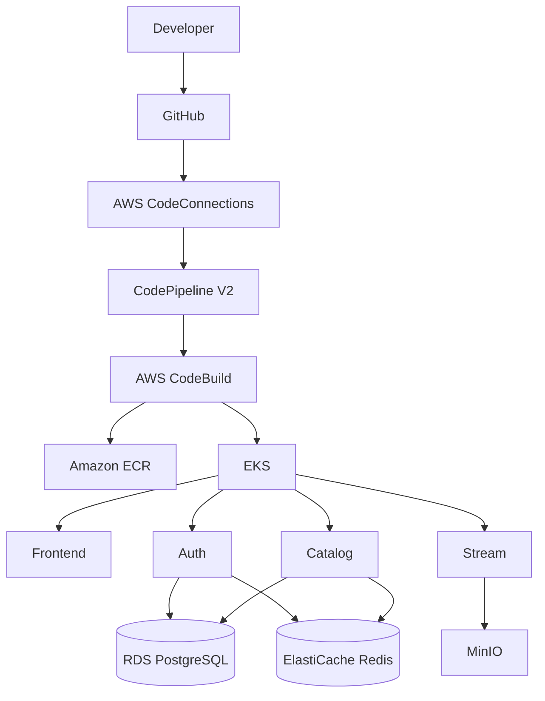

# Architecture Overview

## Purpose
The project is an engineering-focused OTT streaming platform demonstrating cloud infrastructure, Kubernetes, CI/CD, troubleshooting and multi-cloud design.

## Current AWS architecture

## Kubernetes boundaries
- `ott-frontend`: intended frontend boundary.
- `ott-backend`: Auth, Catalog and Stream.
- `ott-media`: MinIO and media-processing resources.

## Important current-state boundary
The latest successful deploy stage proves CodeBuild can configure kubectl and reach EKS. It does **not** prove that Helm was executed, because the current deploy buildspec only echoes the Helm deployment step.

## Portability principle
Applications should consume stable Kubernetes interfaces. Cloud-specific infrastructure belongs below that interface. Secret management is therefore planned as Kubernetes Secret -> External Secrets Operator -> provider-specific backend.
