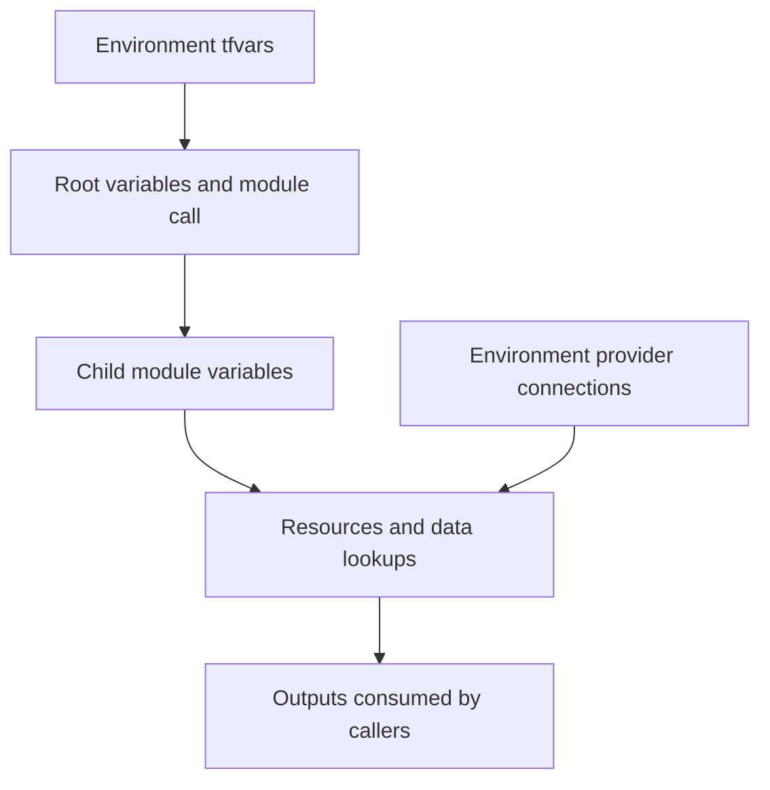

# Terraform concepts explained through the OTT project

Read one concept at a time. Examples explain syntax; do not paste every example into an existing configuration. Some snippets assume inputs/resources already exist.

## 1. HCL and blocks

HCL means HashiCorp Configuration Language. Terraform uses it to describe intended infrastructure.

```hcl
resource "aws_secretsmanager_secret" "application" {
  name = var.application_secret_name
}
```

resource is the block type, aws_secretsmanager_secret is the resource type, application is our local label, and name is an argument. An argument supplies a value. Attributes are values exposed by a resource, such as its arn.

## 2. Provider

A provider translates Terraform operations into platform API requests. AWS and Kubernetes are separate providers.

```hcl
provider "aws" {
  region  = var.aws_region
  profile = "ott-admin"
}
```

Keep connection configuration in each environment's providers.tf. A required_providers declaration identifies provider software; it does not establish a connection.

```hcl
terraform {
  required_providers {
    kubernetes = {
      source = "hashicorp/kubernetes"
    }
  }
}
```

Modules receive configured providers from their calling environment. The SecretStore spec.provider.aws field is ESO configuration, unrelated to Terraform provider connection blocks.

## 3. Resource

A resource declares an object Terraform should manage: create, update or destroy according to the plan.

```hcl
resource "aws_eks_addon" "pod_identity_agent" {
  cluster_name  = module.eks.cluster_name
  addon_name    = "eks-pod-identity-agent"
  addon_version = "v1.3.10-eksbuild.3"
}
```

The local label is not necessarily the remote AWS name. A resource address identifies it in Terraform: aws_eks_addon.pod_identity_agent.

## 4. Data source: read information

A data source reads information; it does not declare ownership of the remote object.

```hcl
data "aws_eks_cluster" "this" {
  name = var.cluster_name
}
```

Read its endpoint using data.aws_eks_cluster.this.endpoint.

| Block | OTT example | Responsibility |
|---|---|---|
| resource | EKS cluster inside the eks module | Manage cluster |
| data | Existing EKS cluster lookup in DEV providers.tf | Read cluster endpoint/CA |
| variable | cluster_name | Accept an input |
| output | module.eks.cluster_name | Expose a result |

A data lookup can read an object also managed elsewhere. Our cluster is managed by the eks module; the data lookup supplies provider connection information. Data reads may happen during planning or be deferred until apply when inputs are unknown.

## 5. Variables and tfvars

A variable is a declared input. tfvars supplies its environment value.

```hcl
variable "aws_region" {
  description = "AWS deployment region"
  type        = string
}
```

DEV terraform.tfvars:

```hcl
aws_region = "us-east-1"
```

Use var.aws_region in expressions. A declaration without default requires a supplied value. A default is a fallback. Examples of input types: string (text), number, bool (true/false), list(string), set(string), map(string), object({...}).

A root environment and a child module have separate variable scopes. Adding an entry to DEV tfvars does not declare an input inside a child module.

## 6. Module inputs and outputs

A module is reusable Terraform configuration. The root module is the environment folder; a child module is called from it.

```hcl
module "external_secrets" {
  source = "../../../modules/external-secrets"
  providers = {
    kubernetes = kubernetes
  }
  aws_region = var.aws_region
  namespace  = var.backend_namespace
}
```

The child must declare aws_region and namespace in its variables.tf. Unsupported argument means the caller supplied an input the child does not declare.

## 7. Output

An output exposes a result from a module.

In terraform/modules/rds/outputs.tf:

```hcl
output "master_user_secret_arn" {
  description = "AWS-managed RDS credentials secret ARN"
  value       = aws_db_instance.database.master_user_secret[0].secret_arn
}
```

The root accesses it as module.rds.master_user_secret_arn.

Outputs in child modules do not automatically appear in the CLI. A root output is needed to expose a child result at the environment level. terraform output reads saved root output values from state.

[0] selects the first element of a list. Here it selects the RDS managed-secret entry.

## 8. Locals

A local is a calculated value reused within the same module. It is not an externally supplied input.

```hcl
locals {
  name_prefix = "${var.project_name}-${var.environment}"
}
```

Use local.name_prefix. It helps avoid repeating expressions.

## 9. Expressions and interpolation

An expression calculates or references a value. Interpolation inserts a value into text.

```hcl
name = "${var.project_name}-${var.environment}-external-secrets"
```

With project_name=ott-platform and environment=dev, this produces ott-platform-dev-external-secrets.

A direct reference needs no string wrapper:

```hcl
role_arn = aws_iam_role.external_secrets.arn
```

## 10. Functions

A function transforms inputs into a result. Terraform functions do not behave like shell commands and do not create AWS resources by themselves.

| Function | Meaning | Example |
|---|---|---|
| jsonencode | Convert a Terraform value into JSON text | jsonencode({ Version = "2012-10-17" }) |
| jsondecode | Convert JSON text into a Terraform value | jsondecode("{\"enabled\":true}") |
| base64decode | Decode base64 text | Decode EKS certificate_authority data |
| file | Read a local text file | file("policy.json") |
| templatefile | Render a text template using supplied variables | templatefile("store.yaml.tftpl", { region = var.aws_region }) |
| format | Build formatted text | format("%s-%s", var.project_name, var.environment) |
| join | Combine list elements into text | join(",", ["auth", "catalog"]) |
| split | Divide text into a list | split(",", "auth,catalog") |
| merge | Combine maps; later values override earlier keys | merge({ Environment = "dev" }, { ManagedBy = "Terraform" }) |
| lookup | Read a map key with a fallback | lookup({ dev = "small" }, "uat", "medium") |
| try | Use the first expression that evaluates without a dynamic error | try(local.settings.port, 6379) |
| coalesce | Choose first non-null/non-empty string argument | coalesce(null, "", "dev") |
| length | Count elements/characters | length(["auth", "catalog"]) |
| toset | Convert a list into a set of unique values | toset(["auth", "catalog"]) |
| sensitive | Mark a value for display redaction | sensitive("example") |

For IAM policies we use jsonencode so Terraform constructs valid JSON without manual escaping.

try does not hide every error: undeclared references and other statically invalid expressions still fail. file/templatefile need existing files; they do not wait for another resource to generate a file.

Explore harmless expressions with terraform console. Do not paste secret values into console output or logs.

## 11. Dependencies

A dependency means one object needs information or readiness from another.

```hcl
role_arn = aws_iam_role.external_secrets.arn
```

This reference creates an implicit dependency. depends_on explicitly declares ordering when references do not capture the relationship:

```hcl
depends_on = [
  aws_eks_addon.pod_identity_agent,
  aws_iam_role_policy.external_secrets_rds
]
```

Use explicit dependencies selectively. They can make plans more conservative and cause more values to be unknown until apply.

## 12. State, backend and locking

State maps Terraform addresses to real objects and records attributes. The backend defines where that record lives; our DEV backend uses S3.

A state lock prevents concurrent state-changing operations when the backend supports/configures locking. S3 versioning is history, not locking by itself.

Do not manually edit or commit state. It can contain sensitive data. Separate environments need separate state locations.

Useful inspection commands:

```powershell
terraform state list
terraform state show 'aws_iam_role.external_secrets'
```

state show may reveal sensitive attributes; inspect outputs before sharing.

## 13. Plan, apply and refresh

Plan calculates differences between configuration, state and remote resources. Apply executes planned changes. Refresh means reading current remote state, not necessarily changing an object.

Symbols:

| Symbol | Meaning |
|---|---|
| + | Create |
| ~ | Update in place |
| - | Destroy |
| -/+ | Replace: destroy then create |
| +/- | Replace: create then destroy |
| known after apply | Result not yet available during planning |

Read the actual action list, not just refresh messages.

## 14. Saved plans and targeting

```powershell
terraform plan '-target=module.external_secrets' '-out=ott-secrets.tfplan'
terraform apply 'ott-secrets.tfplan'
```

-out writes the reviewed plan. Applying that saved plan does not calculate a fresh interactive plan.

-target limits the graph to the selected addresses and needed dependencies. It is useful during this recovery but can omit other pending changes. A complete plan is read-only and should later check outstanding differences.

Quote PowerShell resource addresses. Saved plans may contain sensitive values; exclude them from Git.

## 15. Import: adopt an existing object

Import connects an existing real resource to a Terraform resource address. It does not create that AWS object and is not a substitute for a data lookup.

Conceptual example: if an IAM role existed outside Terraform and was not already tracked:

```hcl
resource "aws_iam_role" "example_existing" {
  name               = "EXISTING_ROLE_NAME"
  assume_role_policy = file("existing-trust-policy.json")
}

import {
  to = aws_iam_role.example_existing
  id = "EXISTING_ROLE_NAME"
}
```

The role name is the AWS provider's import identifier for this resource type. Other types have different import IDs. Plan the import, compare configuration with the existing object, and review any proposed updates before applying.

CLI alternative:

```powershell
terraform import 'aws_iam_role.example_existing' 'EXISTING_ROLE_NAME'
```

CLI import writes the state association; it does not write the desired resource configuration for you. Configuration-driven import can be planned. Neither example should be run for our already-managed ESO role.

An existing object should not be managed under multiple Terraform addresses/states. Import may expose mismatches leading to updates or replacements in the next plan.

## 16. moved blocks: refactor without accidental replacement

A moved block tells Terraform that an existing state address now has a new address.

```hcl
moved {
  from = aws_iam_role.external_secrets
  to   = module.aws_secrets_identity.aws_iam_role.external_secrets
}
```

This is an illustrative future refactor; the destination module is not implemented. Use it only with matching configuration and a reviewed plan. Moving code between files in the same module does not change its resource address and normally needs no moved block.

## 17. count, for_each and dynamic blocks

count creates numbered instances. for_each creates keyed instances from a map/set. dynamic generates repeated nested blocks inside a resource.

```hcl
resource "aws_secretsmanager_secret" "example" {
  for_each = toset(["auth", "catalog"])
  name     = "${var.project_name}/${var.environment}/${each.key}"
}
```

Addresses include keys, such as aws_secretsmanager_secret.example["auth"]. Keys should be stable and non-sensitive. Changing a key changes its address.

## 18. lifecycle

lifecycle adjusts how Terraform handles changes.

| Setting | Meaning |
|---|---|
| prevent_destroy | Reject plans that destroy the protected resource while this protection applies |
| create_before_destroy | Attempt replacement creation before deleting the old object |
| ignore_changes | Ignore specified attributes during update planning |

Do not use ignore_changes to hide unexplained drift. create_before_destroy can fail with unique-name/resource constraints. prevent_destroy is not protection against deletion outside Terraform.

## 19. Sensitive values and our ESO design

sensitive=true redacts ordinary display; it does not by itself keep a value out of state or saved plans.

Our design manages secret metadata and ExternalSecret references through Terraform. ESO retrieves database passwords/JWT values directly. We do not use an aws_secretsmanager_secret_version resource for the JWT value, avoiding storing that value through this Terraform workflow.

| Resource | What it manages |
|---|---|
| aws_secretsmanager_secret | Name/settings of an AWS secret |
| aws_secretsmanager_secret_version | A stored secret value/version; intentionally not used for JWT here |
| kubernetes_manifest ExternalSecret | Remote references and mappings |
| ESO-generated Kubernetes Secret | Actual synchronized values |

## 20. Files and scopes

Terraform reads all .tf files in a module directory together. Filenames organize code; they do not define separate scopes.

| File | Convention |
|---|---|
| providers.tf | Platform connections and root provider requirements |
| variables.tf | Input declarations |
| terraform.tfvars | Environment input values |
| main.tf | Resources/module calls |
| outputs.tf | Exposed results |
| external-secrets.tf | Feature-specific root resources |
| .terraform.lock.hcl | Selected provider versions/checksums; commit intentionally |
| terraform.tfstate / *.tfplan | State/plan artifacts; do not commit |

## Flow to remember



## Common errors from our project

| Error | Meaning | Fix |
|---|---|---|
| Undeclared input variable | This module lacks a variable declaration | Add it to the correct module variables.tf |
| Unsupported argument | Child module does not accept caller's input | Declare that input in the child |
| Undefined provider warning | Child lacks explicit provider requirement | Add required_providers, keep connection in environment |
| Invalid target / extra arguments | PowerShell split the resource address | Quote the complete argument |
| Resource already exists | Remote object exists but intended address may not track it | Inspect state/ownership before considering import |
| No matches for kind ExternalSecret | CRD absent or requested API version unavailable | Verify ESO CRDs and served versions |

## Learning sequence

Start with variable/tfvars, resource/data, output/module, provider, functions, state/plan/apply, dependencies, import/moved and lifecycle. Practice one concept with a small OTT example before continuing.

## Related guides

- [OTT Terraform/Helm/ESO checkpoint](../progress/2026-10-06-terraform-helm-eso.md)
- [ESO implementation](../security/external-secrets-implementation.md)
- [Helm command guide](../helm/README.md)
- [Official Terraform language documentation](https://developer.hashicorp.com/terraform/language)
- [Official import documentation](https://developer.hashicorp.com/terraform/language/import)
- [Official function reference](https://developer.hashicorp.com/terraform/language/functions)
