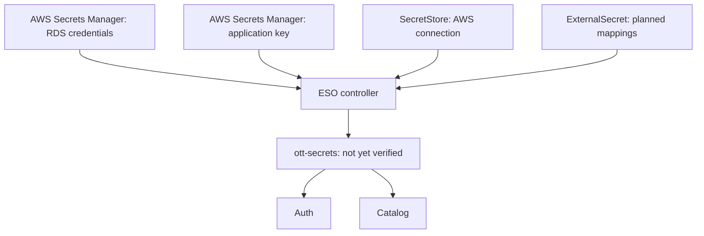
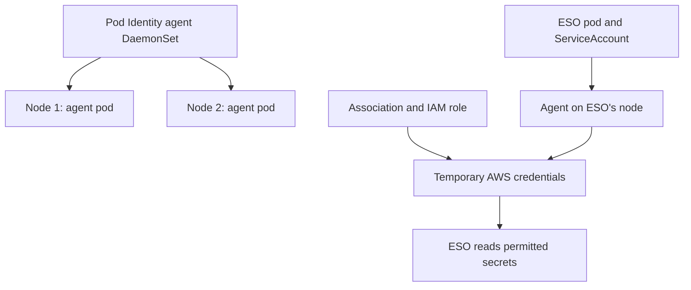
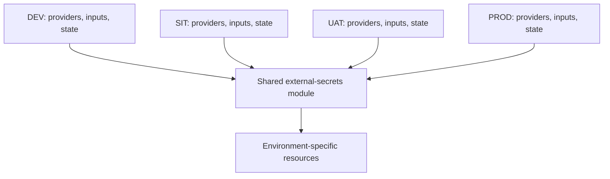

# OTT project progress — 6 October 2026

This checkpoint records work verified through the user's terminal output. Documentation is committed separately from local configuration: this report does not assert that all local Terraform/Helm edits have been pushed.

## Completed and pending

| Work | Evidence/status |
|---|---|
| Git rebase | Completed; main was clean and matched origin/main at that checkpoint |
| Pipeline Source and Build | Succeeded in the inspected execution |
| Deploy diagnosis | Helm failed because CodeBuild could not list ReplicaSets |
| Deployment RBAC | Targeted apply: 0 added, 1 changed, 0 destroyed |
| Permission checks | ReplicaSets and Pods list checks both returned yes |
| Deploy retry | AWS accepted retry; final successful deployment not yet demonstrated |
| Workload diagnosis | Auth/Catalog blocked by missing ott-secrets; Stream/Frontend were Running |
| AWS host configuration | Auth/Catalog rendered correct RDS and Redis hosts; Helm lint passed |
| Pod Identity agent | Targeted apply created add-on; DaemonSet 2 desired/current/ready |
| ESO IAM role and RDS policy | Targeted apply: 2 added |
| Pod Identity association | Targeted apply: 1 added |
| ESO installation | Helm release deployed; all three pods 1/1 Running |
| SecretStore | Terraform module created; Valid, READY=True |
| Application secret metadata | Targeted apply: 1 added |
| IAM policy extension | Targeted apply: 1 changed; includes application secret ARN |
| JWT secret value | Generation/upload instructions supplied; success not yet confirmed |
| ExternalSecret / ott-secrets | Still to implement/verify |
| MinIO | Pending; storage/scheduling cause not yet established |

## Concepts

| Term | Simple explanation |
|---|---|
| Terraform provider | Software that connects Terraform to AWS, Kubernetes or another platform |
| Module | Reusable Terraform configuration receiving environment inputs |
| Variable | Declared input, such as aws_region |
| tfvars | File supplying environment-specific input values |
| State | Terraform's record of resources it manages |
| Plan | Proposed resource changes; does not apply them |
| Saved plan (.tfplan) | Reviewed changes stored for a later apply |
| Refresh | Checking current resource state; not itself a modification |
| Target | Resource/module address limiting a plan and its dependencies |
| IAM role | AWS identity with permissions |
| Trust policy | Who can use the IAM role |
| Permission policy | What the IAM role may do |
| ARN | Amazon Resource Name: identifier for an AWS resource |
| ServiceAccount | Identity assigned to Kubernetes pods |
| Pod Identity association | Link from a namespace/ServiceAccount to an IAM role |
| DaemonSet | Keeps an agent pod on each eligible node |
| Helm chart | Packaged Kubernetes templates and default configuration |
| Helm release | Installed instance of a chart |
| Values | Settings used when generating chart resources |
| Operator | Controller managing a task continuously in Kubernetes |
| ESO | External Secrets Operator: synchronizes external secret values |
| CRD | Adds a custom Kubernetes resource type |
| SecretStore | ESO connection configuration |
| ExternalSecret | ESO instructions mapping external values into a Kubernetes Secret |
| JWT key | Secret used to sign and verify login tokens |

## Architecture and responsibilities



Arrows show configuration/data relationships. ESO initiates the network calls to AWS.



The DaemonSet supports authentication. ESO performs secret synchronization. The IAM role currently permits reads of two specific secrets, not all Secrets Manager resources.

## Environment structure

Provider connection blocks stay in each environment's providers.tf. Modules declare required_providers, which identifies software but does not configure a connection.



DEV is implemented incrementally; SIT/UAT/PROD are the intended promotion structure, not confirmed deployed environments.

Relevant local files:

- terraform/environments/aws/dev/providers.tf — AWS/Kubernetes connections.
- terraform/environments/aws/dev/variables.tf — root input declarations.
- terraform/environments/aws/dev/terraform.tfvars — environment values.
- terraform/environments/aws/dev/external-secrets.tf — add-on, IAM, association, application secret metadata.
- terraform/environments/aws/dev/main.tf — deployer RBAC and external_secrets module call.
- terraform/modules/external-secrets/main.tf — provider requirement and SecretStore.
- terraform/modules/external-secrets/variables.tf — aws_region and namespace inputs.
- terraform/modules/rds/outputs.tf — master_user_secret_arn.
- Helm/ott/values.yaml — local database/Redis defaults.
- Helm/ott/values-dev.yaml — AWS endpoints.
- Helm/ott/templates/auth-deployment.yaml and catalog-deployment.yaml — values-driven host fields.

The field spec.provider.aws inside SecretStore is ESO configuration, not Terraform provider connection configuration.

## Terraform commands used

Run separately in PowerShell from terraform/environments/aws/dev.

| Command | Why we use it |
|---|---|
| terraform init | Initialize backend, discover modules and install/select providers |
| terraform fmt | Format Terraform files |
| terraform validate | Check configuration consistency |
| terraform plan | Preview all pending changes without applying |
| terraform plan '-target=ADDRESS' '-out=FILE.tfplan' | Save a targeted plan |
| terraform apply 'FILE.tfplan' | Apply the saved plan |
| terraform apply '-target=ADDRESS' | Alternative: calculate a targeted plan and ask for confirmation |

PowerShell resource addresses should be quoted. An unquoted target previously produced Invalid target/Too many command line arguments errors.

Targeted commands executed during this recovery/setup:

```powershell
terraform plan '-target=kubernetes_cluster_role_v1.ott_platform_deployer' '-out=rbac-fix.tfplan'
terraform apply 'rbac-fix.tfplan'

terraform plan '-target=aws_eks_addon.pod_identity_agent' '-out=pod-identity.tfplan'
terraform apply 'pod-identity.tfplan'

terraform plan '-target=aws_iam_role_policy.external_secrets_rds' '-out=eso-iam.tfplan'
terraform apply 'eso-iam.tfplan'

terraform plan '-target=aws_eks_pod_identity_association.external_secrets' '-out=eso-association.tfplan'
terraform apply 'eso-association.tfplan'

terraform plan '-target=module.external_secrets' '-out=secret-store.tfplan'
terraform apply 'secret-store.tfplan'

terraform plan '-target=aws_secretsmanager_secret.application' '-out=application-secret.tfplan'
terraform apply 'application-secret.tfplan'

terraform plan '-target=aws_iam_role_policy.external_secrets_rds' '-out=eso-permissions.tfplan'
terraform apply 'eso-permissions.tfplan'
```

These are historical examples, not a batch script to rerun. Dependencies may be inspected/included. Review each plan's actual action list. The targeting warning explains that other changes may be omitted; it is not an apply failure. Use a full read-only plan later to detect outstanding drift/changes. Saved plan files can contain sensitive information and must stay out of Git.

## RBAC correction

CodeBuild's Kubernetes username is ott-platform-codebuild and its group is ott-platform-deployer. The ClusterRoleBinding connects that group to the deployer ClusterRole.

Added read-only rules:

```hcl
rule {
  api_groups = ["apps"]
  resources  = ["replicasets"]
  verbs      = ["get", "list", "watch"]
}

rule {
  api_groups = [""]
  resources  = ["pods"]
  verbs      = ["get", "list", "watch"]
}
```

Verified:

```powershell
kubectl auth can-i list replicasets.apps -n ott-backend --as=ott-platform-codebuild --as-group=ott-platform-deployer
kubectl auth can-i list pods -n ott-backend --as=ott-platform-codebuild --as-group=ott-platform-deployer
```

Both returned yes. Lack of namespaced Roles was not the problem: authorization uses a ClusterRoleBinding.

## Helm commands and explanations

Run chart commands from the repository root.

```powershell
helm lint .\Helm\ott -f .\Helm\ott\values-dev.yaml
git diff --check
helm template ott-platform .\Helm\ott -f .\Helm\ott\values-dev.yaml | Select-String -Pattern "name: POSTGRES_HOST|name: REDIS_HOST" -Context 0,1
```

Lint checks chart issues. Template renders YAML locally without deploying. The icon recommendation was informational. The LF/CRLF message concerned line endings, not chart validity.

ESO repository and inspection:

```powershell
helm repo add external-secrets https://charts.external-secrets.io
helm repo update external-secrets
helm search repo external-secrets/external-secrets --versions
helm show chart external-secrets/external-secrets --version 2.12.0
helm show values external-secrets/external-secrets --version 2.12.0
```

The inspected chart declared kubeVersion >=1.19.0-0. Selected version 2.12.0 was installed on the current cluster successfully.

Installation performed:

```powershell
helm upgrade --install external-secrets external-secrets/external-secrets --version 2.12.0 --namespace external-secrets --create-namespace --set serviceAccount.create=true --set serviceAccount.name=external-secrets --set installCRDs=true --wait --timeout 5m
```

| Argument | Meaning |
|---|---|
| upgrade --install | Update the release or create it if absent |
| First external-secrets | Release name |
| external-secrets/external-secrets | Repository/chart |
| --version 2.12.0 | Pinned chart version |
| --namespace | Release namespace |
| --create-namespace | Create namespace if missing |
| serviceAccount.name | Must match Pod Identity association |
| installCRDs=true | Install ESO custom resource definitions |
| --wait | Wait for readiness |
| --timeout 5m | Limit wait duration |

Verification:

```powershell
kubectl get pods -n external-secrets
kubectl get serviceaccount external-secrets -n external-secrets
kubectl get crd externalsecrets.external-secrets.io secretstores.external-secrets.io
kubectl get daemonset eks-pod-identity-agent -n kube-system
kubectl get secretstore aws-secrets-manager -n ott-backend
```

ServiceAccount SECRETS=0 is normal; static token Secrets are not required for this identity configuration. SecretStore ReadWrite describes provider capabilities, not proof of IAM write permissions.

## AWS endpoints and settings

| Item | Verified value |
|---|---|
| Region | us-east-1 |
| Profile | ott-admin |
| Cluster | ott-platform-dev |
| Kubernetes version used for add-on lookup | 1.33 |
| Pod Identity add-on version | v1.3.10-eksbuild.3 |
| RDS host | ott-platform-dev-postgres.cglme6k8amk5.us-east-1.rds.amazonaws.com |
| RDS initial database | ottdb |
| Redis host | master.ott-platform-dev-redis.kwbhne.use1.cache.amazonaws.com |
| Redis port | 6379 |
| Application secret name | ott-platform/dev/application |

No secret values are included here.

## Operational diagnosis commands

```powershell
kubectl get pods -A
kubectl describe pod POD_NAME -n ott-backend
kubectl describe pod minio-0 -n ott-media
kubectl get pvc -n ott-media
```

CreateContainerConfigError led to the event: secret ott-secrets not found. Images were available on nodes. Pending pods may not have container logs; inspect events/PVCs instead.

Pipeline inspection:

```powershell
aws codepipeline get-pipeline-state --name ott-platform-dev-pipeline --region us-east-1 --profile ott-admin --output json --no-cli-pager
aws codebuild list-builds-for-project --project-name ott-platform-dev-deploy --sort-order DESCENDING --region us-east-1 --profile ott-admin
aws codebuild batch-get-builds --ids BUILD_ID --region us-east-1 --profile ott-admin
aws logs get-log-events --log-group-name "/aws/codebuild/ott-platform-dev-deploy" --log-stream-name LOG_STREAM --start-from-head --region us-east-1 --profile ott-admin --query "events[].message" --output text --no-cli-pager
```

Replace uppercase placeholders with actual identifiers. CodeBuild's generic exit status hid the actionable error; CloudWatch logs exposed the RBAC denial.

## Remaining work in order

1. Confirm secure JWT_SECRET upload succeeded. Do not generate a replacement once applications depend on it unless rotation is intentional.
2. Add ExternalSecret through the reusable module, using environment inputs for secret references/database name.
3. Verify ExternalSecret Ready and ott-secrets key names without displaying values.
4. Commit reviewed local Terraform/Helm configuration; documentation commits do not include those edits.
5. Deploy correct image tags and host settings through the pipeline.
6. Verify Auth/Catalog readiness and actual database/Redis connectivity.
7. Verify catalogdb exists; RDS DBName=ottdb does not enumerate all databases.
8. Check Redis TLS/authentication requirements against application clients.
9. Resolve MinIO Pending; migrate/rotate committed MinIO credentials.
10. Correct unconditional success messages in buildspec post_build.
11. Record ESO chart configuration for repeatable environment promotion and review a complete Terraform plan.

Updating Secrets does not automatically refresh environment variables in running pods. Coordinate database rotation and application restarts.

## Related documentation

- [Helm command reference](../helm/README.md)
- [ESO implementation and diagrams](../security/external-secrets-implementation.md)
- [Original secret architecture decision](../security/secrets.md)
