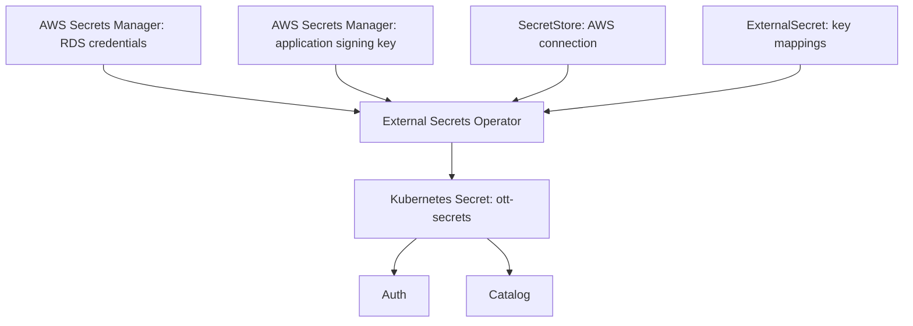
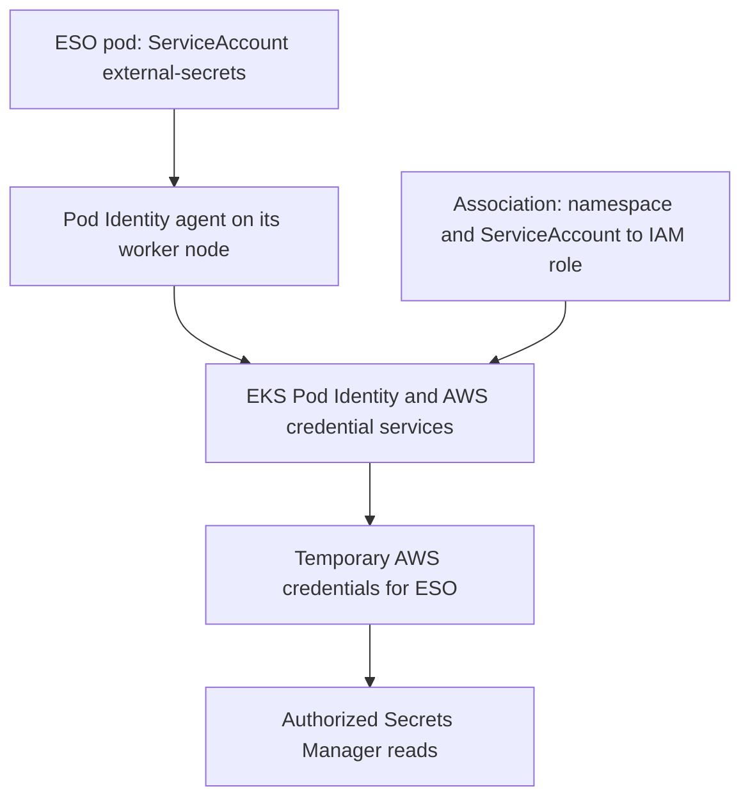
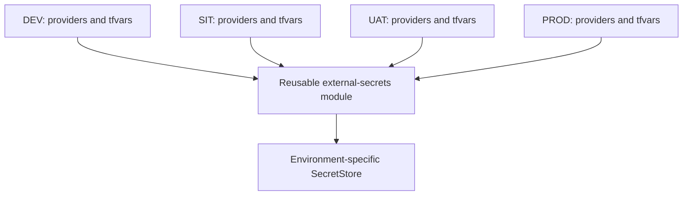

# OTT external secrets: architecture and implementation

## Purpose

Auth and Catalog reference a Kubernetes Secret named `ott-secrets`. They failed with CreateContainerConfigError because it did not exist. External Secrets Operator (ESO) will create and synchronize that Secret from external storage.

ESO is installed and the AWS SecretStore is Valid/Ready. The application ExternalSecret and JWT secret are not yet implemented at this checkpoint. Do not interpret SecretStore readiness as application readiness.

## Terms

| Term | Meaning in this project |
|---|---|
| ESO | External Secrets Operator: software running in Kubernetes that retrieves external secret values |
| Operator | A controller that continually works to make actual resources match their configuration |
| SecretStore | Tells ESO which external secret service and authentication configuration to use |
| ExternalSecret | Specifies remote values and the Kubernetes Secret to create |
| Kubernetes Secret | Resource containing values consumed by application pods |
| IAM role | AWS identity with defined permissions |
| Trust policy | Controls who may assume an IAM role |
| Permission policy | Controls which AWS operations that role may perform |
| ServiceAccount | Kubernetes identity used by a pod |
| Pod Identity association | Connects a namespace/ServiceAccount to an AWS IAM role |
| DaemonSet | Runs an agent pod on each eligible worker node |
| CRD | Custom Resource Definition: adds a resource type to Kubernetes |
| JWT signing key | Secret used to sign and verify authentication tokens |
| Terraform state | Terraform's record of managed resources |
| Targeted plan | Plan limited to specified resources/modules and dependencies |
| Saved plan | File containing reviewed changes to apply |

## Architecture



Arrows represent configuration or delivery relationships, not which service initiates network calls. ESO initiates retrieval from AWS.

## AWS authentication



The agent supports authentication. It does not create ott-secrets. ESO performs synchronization.

The agent DaemonSet was verified with DESIRED=2, CURRENT=2 and READY=2. Both agent pods were Running.

## Verified configuration

| Item | Value |
|---|---|
| Region | us-east-1 |
| EKS cluster | ott-platform-dev |
| Agent add-on | eks-pod-identity-agent |
| Agent version | v1.3.10-eksbuild.3 |
| ESO chart version | 2.12.0 |
| ESO namespace | external-secrets |
| ESO ServiceAccount | external-secrets |
| IAM role | ott-platform-dev-external-secrets |
| SecretStore | aws-secrets-manager |
| SecretStore namespace | ott-backend |
| RDS initial database | ottdb |

The RDS password is AWS-managed. Terraform exposes its secret ARN, not its value. The IAM policy allows GetSecretValue and DescribeSecret for that specific ARN.

## Provider placement and environment promotion

AWS/Kubernetes provider connection blocks remain in each environment's providers.tf. Reusable modules declare required_providers but do not configure connections.



Each environment must use its own state and appropriate cluster/IAM resources. Promote reviewed module code while supplying environment-specific inputs.

The SecretStore's spec.provider.aws field is ESO configuration, not a Terraform provider block.

## File locations

- terraform/environments/aws/dev/providers.tf: AWS and Kubernetes connections.
- terraform/environments/aws/dev/terraform.tfvars: environment inputs, no passwords.
- terraform/environments/aws/dev/external-secrets.tf: current add-on, IAM and Pod Identity resources.
- terraform/modules/rds/outputs.tf: master_user_secret_arn output.
- terraform/modules/external-secrets/variables.tf: aws_region and namespace inputs.
- terraform/modules/external-secrets/main.tf: required_providers and SecretStore.
- terraform/environments/aws/dev/main.tf: module call passing provider and inputs.
- docs/helm/README.md: Helm commands and explanations.

These describe the user's local implementation checkpoint; verify commits before assuming all configuration has reached remote main.

## SecretStore resource

```hcl
terraform {
  required_providers {
    kubernetes = {
      source = "hashicorp/kubernetes"
    }
  }
}

resource "kubernetes_manifest" "secret_store" {
  manifest = {
    apiVersion = "external-secrets.io/v1"
    kind       = "SecretStore"
    metadata = {
      name      = "aws-secrets-manager"
      namespace = var.namespace
    }
    spec = {
      provider = {
        aws = {
          service = "SecretsManager"
          region  = var.aws_region
        }
      }
    }
  }
}
```

Authentication uses ESO's Pod Identity credentials; no static AWS access keys are stored in this resource.

## Planned application mapping

| Target key | Source |
|---|---|
| POSTGRES_USER | RDS-managed secret property username |
| POSTGRES_PASSWORD | RDS-managed secret property password |
| POSTGRES_DB | Environment input, currently ottdb |
| JWT_SECRET | Separate application secret; still to create/populate |

JWT secret values must not be stored in Terraform variables, Helm values or Git. Creating AWS secret metadata through Terraform is different from managing its secret value.

Catalog uses catalogdb. The RDS DBName output identifies the initial database only; it does not prove catalogdb exists. Verify the database separately.

## Host configuration

Auth and Catalog templates now render global.database.host and global.redis.host. AWS values use RDS/ElastiCache endpoints; default values preserve postgres/redis service names. Local Helm lint and host rendering were verified. These local edits still need deployment before pods use them.

Redis TLS/authentication and application client requirements must also be verified before claiming end-to-end connectivity.

## Targeted Terraform workflow

Run individually from terraform/environments/aws/dev:

```powershell
terraform init
terraform validate
terraform plan '-target=module.external_secrets' '-out=secret-store.tfplan'
terraform apply 'secret-store.tfplan'
kubectl get secretstore aws-secrets-manager -n ott-backend
```

PowerShell arguments containing resource addresses are quoted. Dependency refresh output does not imply those dependencies are changing. Review the action list.

-target is an exceptional recovery/incremental setup tool; it can omit other pending changes. A full plan is read-only and should later be used to detect outstanding differences. Keep saved plans out of Git.

## Important limitations and remaining work

1. Create application secret metadata and securely populate the JWT signing key.
2. Grant ESO access to that specific application secret.
3. Create ExternalSecret mappings and verify ott-secrets key names without printing values.
4. Deploy the reviewed host configuration through the pipeline.
5. Verify database availability, Catalog database, Redis requirements and pod readiness.
6. Investigate MinIO Pending separately.
7. Move committed MinIO credentials into secret management and rotate them.

Updating a Kubernetes Secret does not refresh environment variables in existing containers. Coordinate credential rotation with application restarts and database password changes. ESO synchronizes secret values; it does not itself create PostgreSQL users/databases.

## Alternatives

ESO fits the existing secretKeyRef application contract and supports different external stores. Other designs include Secrets Store CSI Driver (mounted files), direct application retrieval, encrypted Git files, or manual Secrets. CyberArk Secrets Manager can serve as an ESO source, but migrating AWS-managed RDS password ownership requires a separate design.
